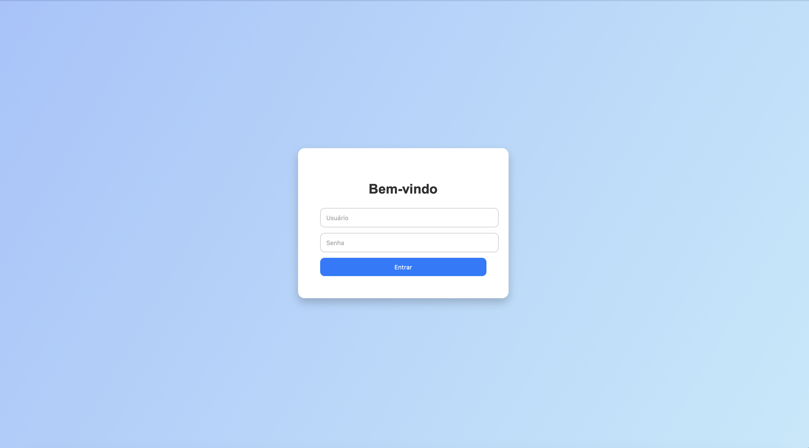
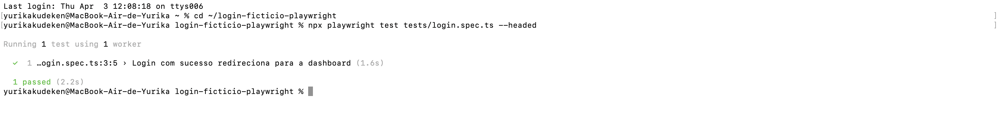

  

# ✨ Formulário de Login Fictício + Testes com Playwright ✨

Criado por **Yurika Kudeken** para treinar automações de testes E2E com Playwright, unindo HTML, CSS e TypeScript.

---

## 📌 Sobre o projeto

Este repositório combina duas habilidades:  
🌈 uma interface de **formulário de login fictício** criada com HTML + CSS  
🧪 e **testes automatizados com Playwright** simulando interações reais do usuário.

A ideia foi construir um ambiente visual simples, bonito e funcional, perfeito para aplicar e mostrar seus conhecimentos em automação de testes.

---

## 💻 Interface HTML/CSS

A página foi criada do zero com HTML e CSS puros, com foco em clareza visual e semântica.  
Ela simula uma tela de login com campos de usuário e senha + botão de entrada. ✨

---

## 🧪 Testes com Playwright

Os testes foram escritos com **Playwright + TypeScript** e verificam diferentes cenários de login.  
O ambiente de testes simula um fluxo real de autenticação com base no site de exemplo da Practice Test Automation.

  

### Cenários testados:

✅ Login com credenciais válidas  
⚠️ Tentativas com campos vazios  
❌ Senha incorreta  
🔒 Senha muito curta

---

## 🌙✨ こんにちは、ゆりかです！

これは、HTMLとCSSでデザインされたログインフォームに対して、Playwrightで自動テストの練習をするためのプロジェクトです。  
フォームの作成だけでなく、E2Eテストのシナリオ作成にも力を入れました。

### ✅ テストした内容：

- 正しいログイン情報でのログイン成功  
- 空のフィールドでのログイン失敗  
- 間違ったパスワードでの失敗  
- 短すぎるパスワードによるエラー  

UIはシンプルですが、学習にはぴったりです！

---

## 💌 Sobre mim

- 👩🏻‍💻 Desenvolvedora em formação  
- 🎨 Criadora de experiências digitais visuais  
- 🌏 Baseada no Japão, apaixonada por manhãs, café e código  
- 🚀 Em busca de liberdade criativa e profissional  

---

Feito com ✨ dedicação, curiosidade e capuccinos mágicos com whey sabor leite condensado ✨
